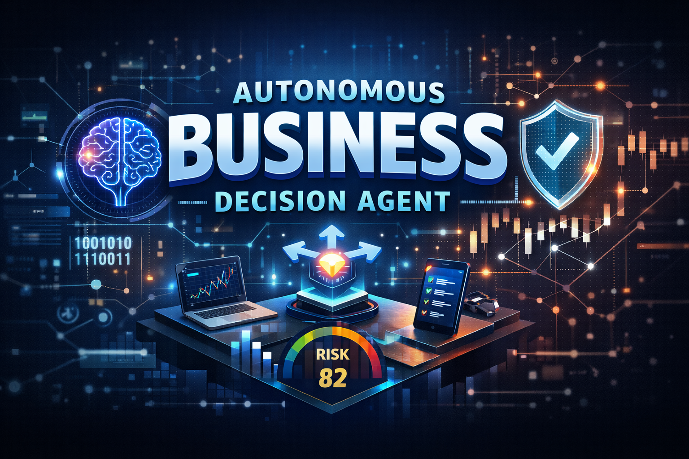
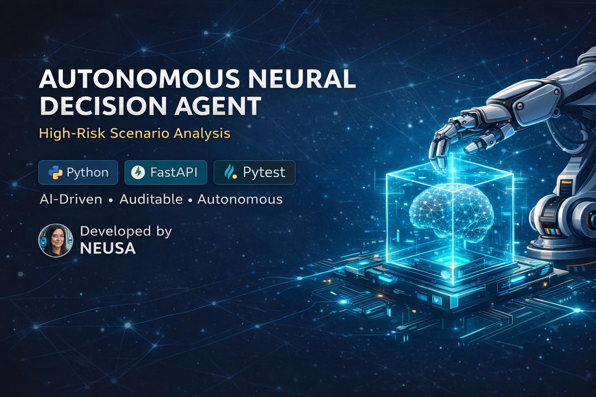
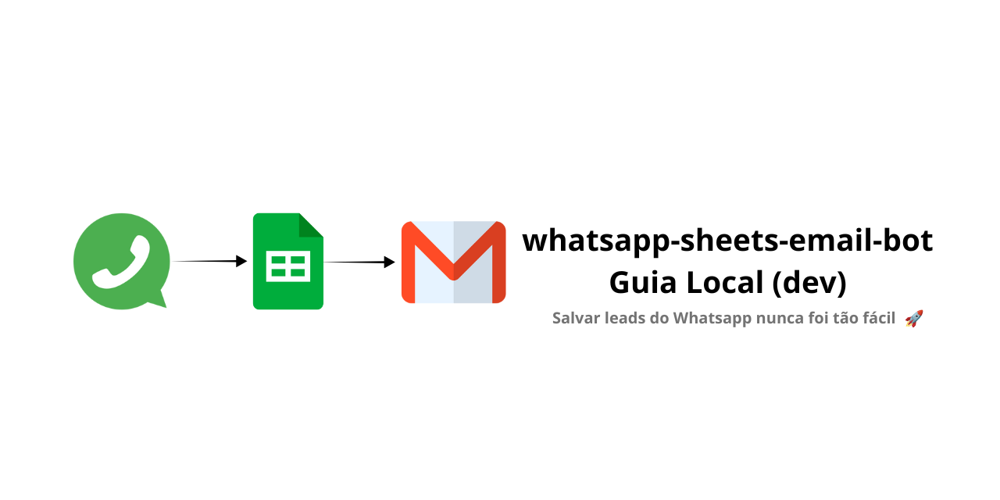
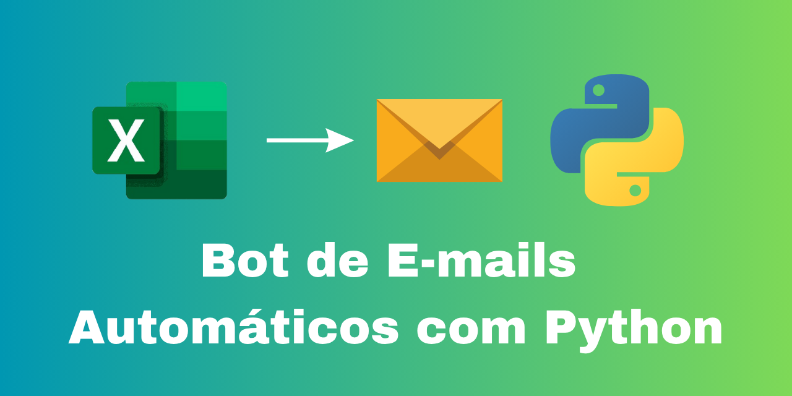
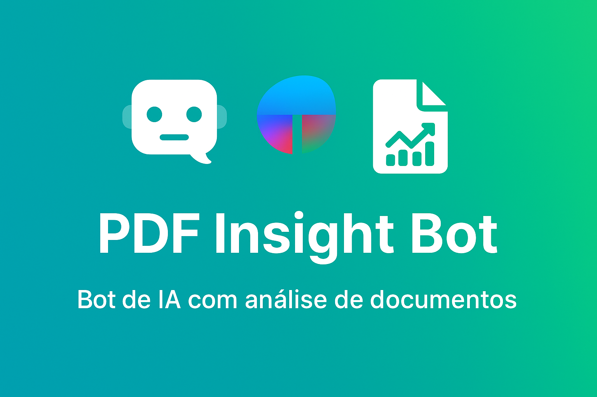
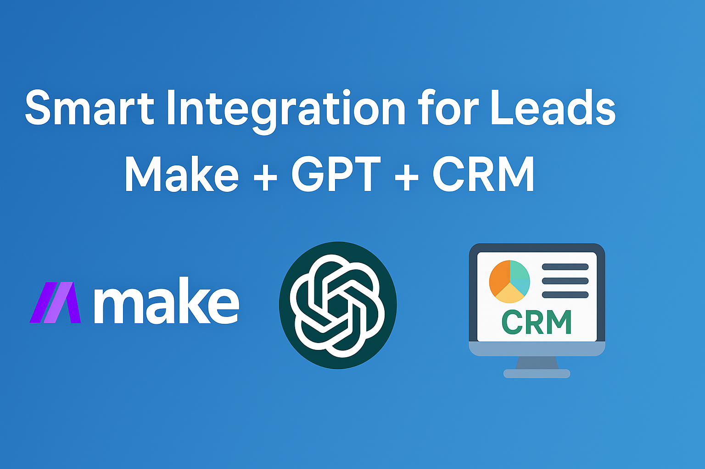
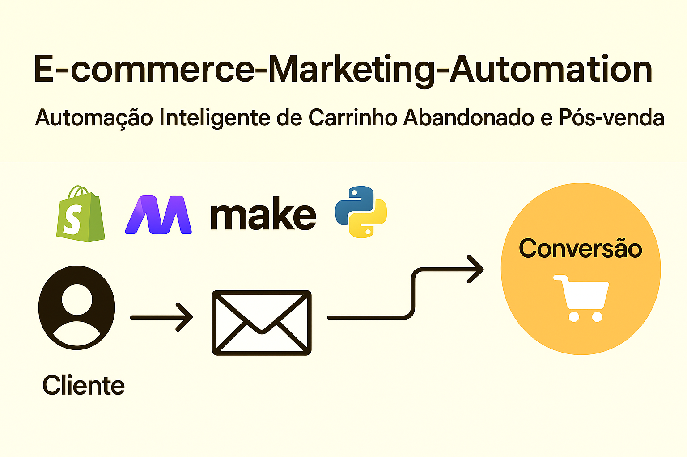

  
  
  
  

<h1 align="center">🗂️ Project Portfolio — NeusaM21</h1>

  Intelligent solutions in <strong>Autonomous Decision Systems, AI Automation, and No-Code Integrations</strong> 
  Production-ready projects designed to solve real business problems.

<h2 align="center">🧠 Autonomous Decision Systems (Enterprise-Grade)</h2>

<table>
  <tr>
    <td align="center">
      <a href="https://github.com/NeusaM21/autonomous-business-decision-agent">
         
        <strong>Autonomous Business Decision Agent</strong>
      </a>
       
      

        Deterministic and explainable business decision engine with audit logs, scoring logic,
        and controlled execution designed for enterprise-grade systems.
      

    </td>
    <td align="center">
      <a href="https://github.com/NeusaM21/autonomous-risk-decision-agent">
         
        <strong>Autonomous Risk Decision Agent</strong>
      </a>
       
      

        Autonomous risk classification engine featuring explainability, human-in-the-loop control,
        and production-ready decision pipelines for regulated environments.
      

    </td>
  </tr>
</table>

<h2 align="center">⚙️ AI Automation & Business Systems (PT-BR)</h2>

<table>
  <tr>
    <td align="center">
      <a href="https://github.com/NeusaM21/whatsapp-sheets-email-bot">
         
        <strong>WhatsApp Sheets Email Bot</strong>
      </a>
       
      

        Webhook que salva leads no Google Sheets e dispara e-mails automáticos.
      

    </td>
    <td align="center">
      <a href="https://github.com/NeusaM21/email_bot">
         
        <strong>Email Bot</strong>
      </a>
       
      

        Envio automatizado de e-mails personalizados via Excel + Python.
      

    </td>
  </tr>
  <tr>
    <td align="center">
      <a href="https://github.com/NeusaM21/pdf-insight-bot">
         
        <strong>PDF Insight Bot</strong>
      </a>
       
      

        Extração de insights e respostas automáticas de documentos PDF com IA.
      

    </td>
    <td align="center">
      <a href="https://github.com/NeusaM21/smart-integration-leads">
         
        <strong>Smart Integration Leads</strong>
      </a>
       
      

        Integração Make + GPT + CRM para captação e nutrição de leads.
      

    </td>
  </tr>
  <tr>
    <td align="center">
      <a href="https://github.com/NeusaM21/ecommerce-marketing-automation-project">
         
        <strong>E-commerce Automation</strong>
      </a>
       
      

        Automação de marketing e vendas para e-commerce com IA.
      

    </td>
  </tr>
</table>

<h2 align="center">🛠️ Technologies</h2>

  <strong>Python</strong>, <strong>FastAPI</strong>, <strong>Pydantic</strong>, <strong>Pytest</strong>, <strong>Decision Rules Engine</strong> 
  <strong>LangChain</strong>, <strong>Streamlit</strong>, <strong>Gemini API</strong>, <strong>OpenAI API</strong> 
  <strong>Make</strong>, <strong>Zapier</strong>, <strong>Google Sheets</strong>, <strong>REST APIs</strong> 
  <strong>Audit Logs</strong>, <strong>Human-in-the-loop</strong>, <strong>VS Code</strong>, <strong>GitHub</strong>

<h2 align="center">📬 Contact</h2>

  
    
  <em>Available for freelancing, enterprise projects, and international collaborations</em>

