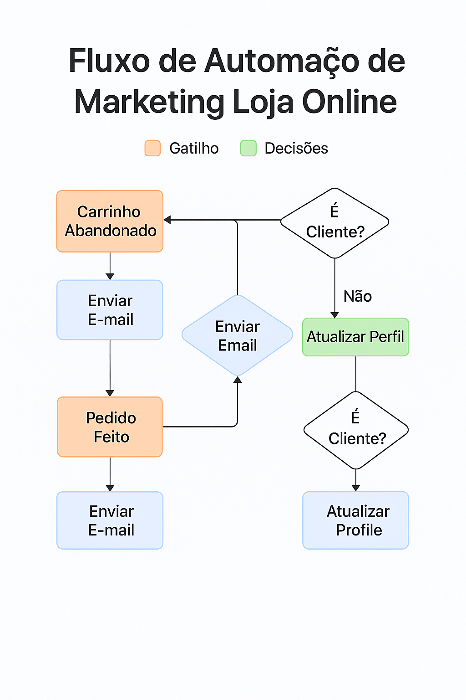
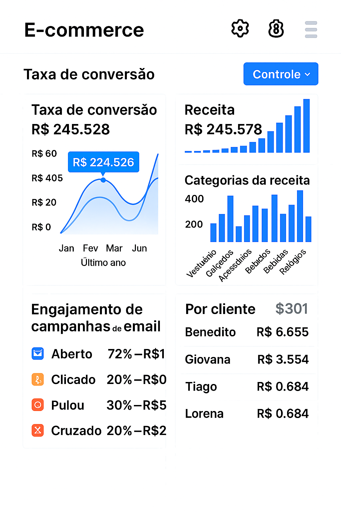

# 🛒 Automação Inteligente para E-commerce

### Conversão de Carrinhos e Fidelização 🚀


-blue)


## 🧭 Navegação Rápida

- [📝 Visão Geral do Projeto](#-visão-geral-do-projeto)
- [🔍 Problema Endereçado](#-problema-endereçado)
- [🎯 Objetivos da Automação](#-objetivos-da-automação)
- [🎯 Público-Alvo](#-público-alvo)
- [✨ Funcionalidades Principais](#-funcionalidades-principais)
- [🛠️ Tecnologias e Ferramentas Utilizadas](#️-tecnologias-e-ferramentas-utilizadas)
- [🚀 Demonstração](#-demonstração)
- [⚙️ Como o Projeto Funciona](#️-como-o-projeto-funciona-para-desenvolvedoresanalisadores)
- [📚 Documentação Detalhada](#-documentação-detalhada)
- [📊 Dados de Exemplo](#-dados-de-exemplo)
- [👤 Autor](#-autor)
- [📄 Licença](#-licença)

## 📝 Visão Geral do Projeto

Este projeto de portfólio demonstra a implementação de um sistema robusto de automação de marketing e vendas focado em e-commerce. O objetivo principal é otimizar o funil de vendas, recuperando carrinhos abandonados e fomentando a recompra, resultando em aumento de receita e fidelização de clientes para uma loja online fictícia de produtos artesanais.

---

## 🔍 Problema Endereçado

Lojas online frequentemente enfrentam desafios como:

* Muitas vendas perdidas por causa do abandono de carrinho.
* Baixa taxa de recompra, indicando a necessidade de um relacionamento pós-venda mais eficaz.

Esta automação foi projetada para mitigar esses problemas, transformando visitantes interessados em clientes fiéis e maximizando o retorno sobre o investimento em aquisição.

---

## 🎯 Objetivos da Automação

Os principais objetivos deste projeto são:

* Aumentar a **taxa de recuperação de carrinho abandonado em 15%**.
* Aumentar a **taxa de recompra** de clientes em **10%**.
* Melhorar a **experiência do cliente** no pós-compra e incentivar feedback.

---

## 🎯 Público-Alvo

Este projeto foi desenvolvido com foco nos seguintes perfis:

- **Recrutadores e profissionais de tecnologia** que desejam avaliar habilidades em automação, Python e marketing digital.
- **Donos de e-commerce ou gestores de marketing** que buscam entender como implementar automações de recuperação de carrinho e pós-venda.
- **Desenvolvedores iniciantes ou intermediários** que queiram aprender como integrar ferramentas como Klaviyo, Make, WhatsApp API e Google Sheets com Python.

---

## ✨ Funcionalidades Principais

O sistema de automação implementa os seguintes fluxos e capacidades:

1. **Sequência de E-mails de Recuperação de Carrinho**
2. **Fluxo de Boas-Vindas e Pós-Compra**
3. **Lead Scoring com Python**
4. **Notificações Automatizadas via WhatsApp (simulado)**
5. **Relatórios de Performance com Python**

---

## 🛠️ Tecnologias e Ferramentas Utilizadas

- **Shopify (Simulado)** – eventos de abandono de carrinho e compra
- **Klaviyo** – fluxos de e-mails, segmentação e personalização
- **Python** – automações, relatórios e integração com APIs
- **Zapier / Make (No-Code - Simulado)** – automações entre ferramentas
- **Google Sheets / CSV/XLSX** – simulação de dados e resultados
- **Git & GitHub** – controle de versão e hospedagem

---

## 🚀 Demonstração

* 📊 Workflow no Klaviyo:  
  

* ✉️ E-mail de Recuperação:  
  

* 📈 Relatório de Performance:  
  

---

## ⚙️ Como o Projeto Funciona (para Desenvolvedores/Analisadores)

Para entender a lógica de automação e a estrutura de código, siga estes passos:

1. **Clone o Repositório:**
    ```bash
    git clone https://github.com/NeusaM21/ecommerce-marketing-automation.git
    cd ecommerce-marketing-automation
    ```

2. **Estrutura de Pastas:**
    * `modules/`: Contém os scripts Python e módulos auxiliares, como envio de e-mails, lead scoring, bot do WhatsApp e configuração.
    * `data_samples/`: Contém os dados simulados, como planilhas de carrinhos abandonados e lista de clientes.
    * `assets/`: Armazena todas as imagens, diagramas, GIFs e screenshots de apoio.
    * `docs/code/`: Contém a documentação detalhada do projeto, incluindo análise, fluxos e resultados.

3. **Configuração do Ambiente Python (se você for rodar os scripts):**
    * Certifique-se de ter o Python instalado.
    * Instale as dependências listadas no `requirements.txt`:
        ```bash
        pip install -r requirements.txt
        ```
    * Crie seu arquivo de configuração para as APIs (NÃO INCLUA CREDENCIAIS REAIS NESTE REPOSITÓRIO PÚBLICO!):
        * Copie o template:
            ```bash
            cp config_template.py config.py
            ```
        * Edite o `config.py` e preencha com credenciais fictícias ou de teste para as APIs que você usaria (Klaviyo, WhatsApp, etc.).

4. **Execução dos Scripts (Exemplo):**
    * O arquivo `main.py` orquestra as automações. Você pode executá-lo para simular o processo:
        ```bash
        python main.py
        ```
    * Explore os módulos em `modules/` para entender as funcionalidades específicas de envio de e-mail, lead scoring e o bot de WhatsApp.

---

## 📚 Documentação Detalhada

Para uma compreensão aprofundada da análise estratégica, dos fluxos de automação e dos detalhes da implementação, explore os arquivos na pasta `docs/`:

- [01 - Análise e Público-Alvo](docs/01_Analise_Publico_Alvo.md)  
- [02 - Fluxos de Ecommerce](docs/02_Fluxos_Ecommerce.md)  
- [03 - Tecnologias e Implementação](docs/03_Tecnologias_usadas.md)  
- [04 - Insights e Resultados Simulados](docs/04_Insights_Resultados.md)

---

## 📊 Dados de Exemplo

Este projeto inclui arquivos fictícios para simular cenários reais de e-commerce. Eles estão localizados na pasta `code/data_samples/`:

| Arquivo                      | Descrição                                 |
|-----------------------------|-------------------------------------------|
| `clientes.csv`              | Lista de clientes com dados simulados.    |
| `carrinhos_abandonados.xlsx`| Simulação de carrinhos abandonados.       |

> ⚠️ **Nota:**  
> O GitHub não permite visualizar diretamente arquivos `.xlsx` na interface web.  
> Para ver o conteúdo da planilha `carrinhos_abandonados.xlsx`, clique em **“Download”** ou **“View raw”** e abra localmente no Excel, LibreOffice ou outro programa compatível.

---

## 👤 Autor

**NeusaM21**  
Dev Python com foco em Automação e Projetos de IA  
📧 [Email](mailto:contact.neusam21@gmail.com)

---

## 📄 Licença

Este projeto está licenciado sob a Licença MIT – veja o arquivo [LICENSE](LICENSE) para detalhes.
