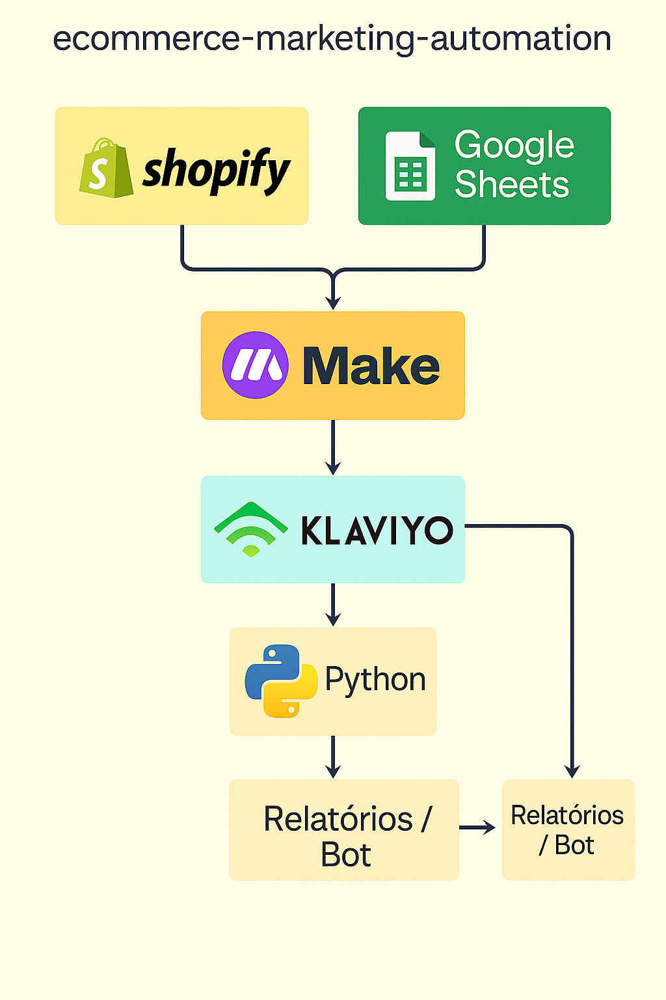

# 🔁 Fluxos de Automação para E-commerce

Este documento descreve os principais fluxos de automação implementados no projeto, focando em dois momentos cruciais: **recuperação de carrinhos abandonados** e **engajamento pós-compra**.

---

## 🛒 Fluxo de Recuperação de Carrinho Abandonado

Este fluxo é acionado sempre que um cliente adiciona produtos ao carrinho, mas não finaliza a compra dentro de um período determinado.

### 🔹 Etapas:

1. **Identificação do abandono** (via Shopify ou ferramenta de automação).
2. **Disparo automático do primeiro e-mail de lembrete** após 1 hora.
3. **Segundo e-mail com senso de urgência** após 24 horas.
4. **E-mail final com desconto progressivo ou oferta limitada** após 48 horas.
5. **(Opcional)** Envio de notificação via WhatsApp (simulado).

### 📌 Objetivo:

Recuperar vendas perdidas, criando um senso de urgência e personalizando a abordagem.

### 📷 Ilustração do fluxo:

---

## 🎁 Fluxo Pós-Compra (Engajamento e Fidelização)

Após a confirmação do pedido, um novo fluxo se inicia com o objetivo de manter o cliente engajado e incentivar novas compras.

### 🔹 Etapas:

1. **E-mail de confirmação de pedido** com detalhes da compra.
2. **E-mail de agradecimento + sugestão de avaliação** após 3 dias.
3. **Recomendação de novos produtos** baseada na compra anterior (simulada).
4. **Desconto exclusivo para próxima compra** após 15 dias.

### 📌 Objetivo:

Aumentar a taxa de recompra, incentivar avaliações positivas e fidelizar o cliente.

---

## 🧠 Integração com Scripts e Tecnologias

Os fluxos são orquestrados com apoio de scripts Python e ferramentas no-code, simulando um cenário de automação realista e profissional.

- O script `lead_scoring.py` é usado para qualificar leads com base em comportamento.
- O `whatsapp_bot.py` simula envios de mensagens para recuperar carrinhos ou informar status do pedido.
- O `main.py` executa os testes e fluxos de forma coordenada.

### 📷 Diagrama das Tecnologias Envolvidas:

---

## ✅ Observação

Todas as imagens, fluxos e dados são **simulados** para fins educacionais e de portfólio.

---

🔙 [Voltar para a documentação detalhada](../README.md)

---
