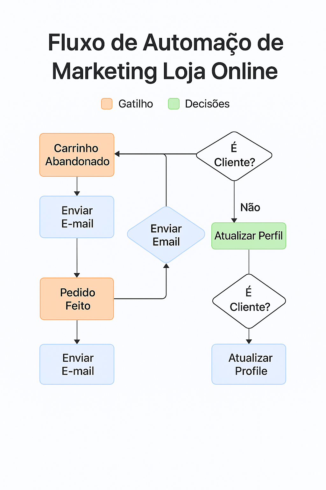

# 03 - Tecnologias e Ferramentas Utilizadas

Este documento apresenta as principais tecnologias aplicadas na construção e simulação dos fluxos de automação. A proposta é demonstrar como ferramentas técnicas — reais e simuladas — podem ser integradas para otimizar a conversão e a fidelização em um e-commerce.

---

## 🐍 Linguagem de Programação: Python

Python foi utilizado para desenvolver scripts de automação, geração de relatórios, bots de WhatsApp e integração com APIs externas.

### 📚 Bibliotecas principais:

- `pandas` → Manipulação de dados (clientes, carrinhos, interações)  
- `openpyxl` → Leitura e escrita de planilhas (XLSX, CSV)  
- `requests` → Integração com APIs como WhatsApp, Klaviyo e Google Sheets  
- `matplotlib` → Criação de gráficos e visualizações de desempenho  
- `datetime` → Controle de datas, horários e delays nos fluxos

---

## 🧩 Plataformas e Ferramentas de Automação

### ✉️ Klaviyo (conceitual/simulado)

Plataforma de automação de marketing focada em e-commerce.

Simulações realizadas:

- Fluxo de **recuperação de carrinho**  
- Fluxo de **pós-compra e fidelização**  
- Envio de e-mails segmentados por comportamento  
- Métricas de abertura, cliques e conversão

📸 Exemplo de fluxo no Klaviyo:  

---

### 🛍️ Shopify (simulada)

Plataforma de e-commerce utilizada apenas como referência para simulação de:

- Gatilhos de abandono de carrinho e confirmação de pedido  
- Consulta ao histórico de pedidos  
- Perfis de clientes e eventos da loja

---

## 🤖 Bots Automatizados via Python

Scripts desenvolvidos para simular interações automáticas via API do WhatsApp:

### `whatsapp_bot.py`

- Envio de lembretes de carrinho abandonado  
- Confirmação de pedidos  
- Simulações com APIs como Z-API e Twilio

---

## 📊 Google Sheets como base de CRM

Planilhas do Google foram utilizadas como banco de dados leve e acessível para:

- Segmentar listas de clientes (ativos, inativos, engajados)  
- Simular leads e carrinhos abandonados  
- Gerar relatórios com filtros e visualizações

---

## 🔄 Integrações No-Code (conceituais)

### 🔧 Make (ex-Integromat)

Simulação de automações entre sistemas externos, como:

- Shopify + Klaviyo  
- Klaviyo + WhatsApp  
- Google Sheets + Python  

🔁 Exemplos de automações:

- Novo pedido → envia confirmação automática  
- Carrinho abandonado → cria evento de follow-up  
- Cliente inativo → dispara campanha de reativação

---

## 🛠️ Outras Ferramentas Utilizadas

| Ferramenta           | Finalidade                                                  |
|----------------------|-------------------------------------------------------------|
| **VS Code**          | Ambiente principal de desenvolvimento                      |
| **Git + GitHub**     | Controle de versão e publicação do projeto                 |
| **Draw.io**          | Criação de fluxogramas e esquemas visuais                  |
| **Markdown (.md)**   | Documentação técnica no formato Markdown                   |
| **ChatGPT**          | Apoio na estruturação, geração de conteúdo e simulações    |

---

## 🖼️ Diagrama das Tecnologias Utilizadas

  

---

## ✅ Conclusão

A combinação entre código (Python), integrações no-code (Make) e plataformas de marketing (Klaviyo, Sheets) permitiu construir um projeto funcional, realista e escalável. Com pequenos ajustes, esses fluxos podem ser implementados em ambientes reais, tornando este projeto um ativo valioso no portfólio.

---

🔙 [Voltar para a documentação detalhada](../README.md)

---
