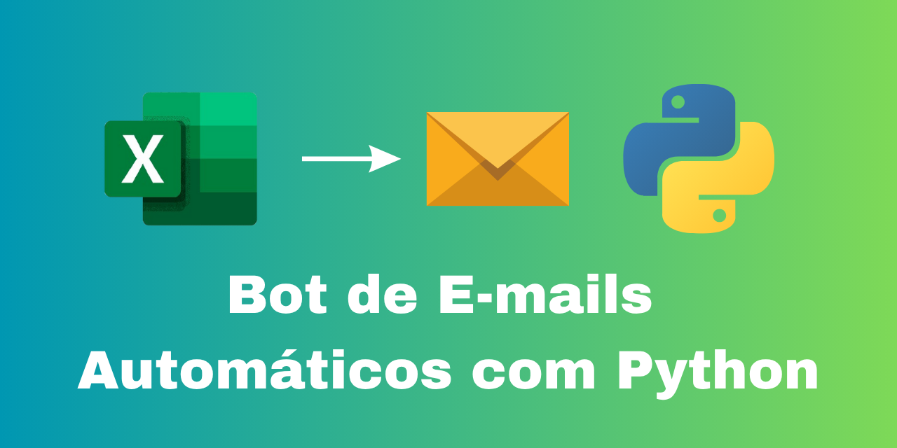

# 📧 Bot de E-mails Automáticos com Python

Automatize o envio de e-mails personalizados usando Python e planilhas Excel. Ideal para cobranças, notificações, lembretes e mensagens recorrentes — tudo de forma rápida, segura e personalizável.

---

## 🚀 Funcionalidades

- 📊 Leitura automática de planilha com dados dos destinatários  
- ✍️ Geração de mensagens personalizadas com nome, valor e vencimento  
- 📬 Envio de e-mails automáticos via Gmail com autenticação segura  
- 🔐 Armazenamento seguro de credenciais usando `.env`  
- 🧩 Código limpo, comentado e fácil de adaptar a novos cenários  

---

## 🛠️ Requisitos

- Python 3.x  
- Bibliotecas: `pandas`, `openpyxl`, `schedule`, `smtplib`, `email`

---

## ⚙️ Como usar

1. Crie um arquivo `.env` com seu e-mail e a senha de aplicativo do Gmail  
2. Preencha a planilha `clientes.xlsx` com os dados dos destinatários  
3. Execute o script `email_bot.py` para enviar os e-mails  

---

## 🧾 Exemplo da planilha `clientes.xlsx`:

| Nome  | Email           | Valor | Vencimento  |
|-------|------------------|--------|--------------|
| João  | joao@email.com   | 150.0  | 01/07/2025   |
| Maria | maria@email.com  | 200.0  | 03/07/2025   |
| Pedro | pedro@email.com  | 300.0  | 05/07/2025   |

---

## 🔒 Segurança com `.env`

Este projeto usa um arquivo `.env` para armazenar dados sensíveis (como seu e-mail e senha de app).  
Esse arquivo está no `.gitignore` e **não será enviado ao GitHub** por segurança.

### Exemplo de `.env`:

```env
EMAIL_REMETENTE=seuemail@gmail.com
SENHA_DO_APP=sua_senha_de_aplicativo
```

## Licença

Este projeto está licenciado sob a Licença MIT - veja o arquivo [LICENSE](LICENSE) para mais informações.


Feito com 💙 por [NeusaM21](https://github.com/NeusaM21)


