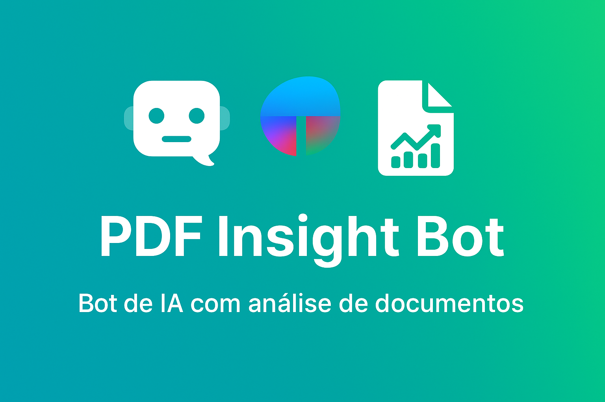
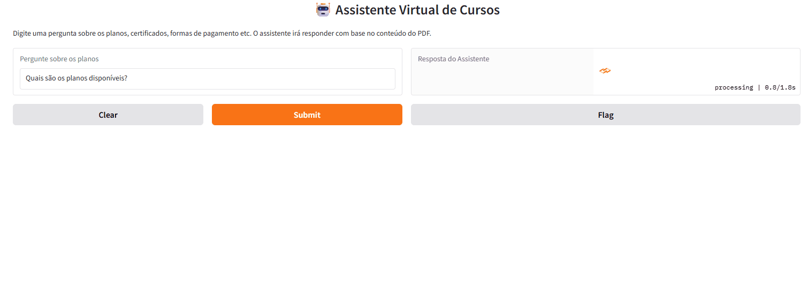

📖 You’re reading the **English version** of this project description.  
🇧🇷 Versão em Português disponível aqui: [README.md](README.md)

---




# 📄 PDF Insight Bot (with Gemini API)

This project is an AI-powered PDF assistant that reads, understands, and answers questions about documents using **Google AI’s Gemini 1.5 Flash model**. Perfect for studying applied AI, building portfolio projects, or even automating support based on technical and business documents.

---

## 📚 Table of Contents

* [💡 Features](#-features)
* [💬 Usage Example](#-usage-example)
* [📂 Project Structure](#-project-structure)
* [🛠️ Technologies Used](#️-technologies-used)
* [🚀 How to Run Locally](#-how-to-run-locally)
* [📈 Next Improvements](#-next-improvements)
* [✍️ Author](#️-author)
* [📝 License](#-license)

---

## 💡 Features

✅ **Gemini API integration** (Google AI)  
✅ Reads **multiple PDFs automatically**  
✅ Generates **embeddings with LangChain and FAISS**  
✅ **Contextual responses** based on real PDF content  
✅ Smart keyword highlighting in the terminal output 
✅ Lightweight, beginner-friendly, and portfolio-ready

✨ **Extra Feature:**  
✅ Visual keyword highlights in the terminal (e.g., Topic, Technology, Sector) for better readability of AI responses.

---

## 🎥 See the Assistant in Action



🎯 Test this graphical interface version locally:

```bash
python web_app.py
```
---

## 💬 Usage Example

**Question:** What is the main topic of the document?

**Answer:** The 📚 **TOPIC** of the document is the impact of 🧠 **TECHNOLOGY**—specifically blockchain—on the market and the regulation of virtual currencies.


---

## 📂 Project Structure

> 📌 Note: The filenames in the project remain in Portuguese to reflect the original structure. All usage instructions are fully translated.

```
pdf-insight-bot/
├── assets/
│ ├── demo-assistente-virtual-v2.gif
│ └── pdf-insight-bot-terminal.gif
├── data/
│ └── documents/
│ ├── inteligencia_artificial.pdf
│ ├── blockchain_no_mercado.pdf
│ └── impacto_da_automacao.pdf
├── utils/
│ └── leitor_pdf.py
├── .env.example
├── README.md
├── README.en.md
├── requirements.txt
├── requirements-full.txt
├── teste_leitor_pdf.py
├── teste_gemini.py
├── web_app.py
└── capa.png
```
---

## 🛠️ Technologies Used

**Python 3**, **LangChain**, **Gemini API (Google AI)**, **FAISS**, **python-dotenv**

---

## 🚀 How to Run Locally

1.  **Clone this repository:**
    ```bash
    git clone https://github.com/MrsM21/pdf-insight-bot.git
    cd pdf-insight-bot
    ```

2.  **Install dependencies:**
    ```bash
    pip install -r requirements.txt
    ```

3.  **Create a `.env` file with your Gemini API key:**
    ```
    GEMINI_API_KEY=your-key-here
    ```

4.  **Place your PDF files in:**
    `data/documents/`

5.  **Run the test script:**
    ```bash
    python teste_leitor_pdf.py
    ```

---

## 📈 Future Improvements

* [ ] Save FAISS vector database as a .pkl file
* [ ] Web interface with Gradio or Streamlit
* [ ] Online version with free deploy (Replit, Render)
* [ ] Integration with mini-CRM to store queries and contacts

---

## ✍️ Author

Project created by [**NeusaM21**](https://github.com/NeusaM21) as part of her Applied AI portfolio. Built with passion, lots of learning, and ✨ an unhealthy amount of coffee.

---

## 📝 License

This project is under the [MIT License](https://github.com/NeusaM21/pdf-insight-bot/blob/main/LICENSE). Use it, adapt it, and share it—just don’t forget to give credit. 😉
